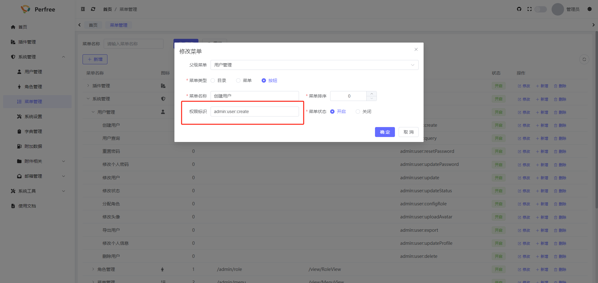

# 权限控制
项目采用Spring Security进行权限控制, 默认会拦截所有/api/auth/开头的接口地址,其他接口默认放行, 配置规则如下
```java
@Bean
public SecurityFilterChain securityFilterChain(HttpSecurity http) throws Exception {
    http.csrf(AbstractHttpConfigurer::disable)
            .headers(headers -> headers.frameOptions(HeadersConfigurer.FrameOptionsConfig::disable))
            .authorizeHttpRequests(request -> request
                    .requestMatchers("/api/auth/**").authenticated()
                    .anyRequest().permitAll()
            )
            .sessionManagement(manager -> manager.sessionCreationPolicy(IF_REQUIRED))
            //  配置跨域
            .addFilterBefore(corsFilter, UsernamePasswordAuthenticationFilter.class)
            //  将配置交由JWT
            .addFilterBefore(jwtAuthorizationFilter, UsernamePasswordAuthenticationFilter.class);
    return http.build();
}
```
## 接口权限控制
系统支持精确的控制每个接口的权限,您可以先在菜单管理中配置按钮权限,如下图



之后在指定的接口上增加权限注解@PreAuthorize
```java
@PostMapping("/add")
@Operation(summary = "添加")
@DemoMode
@PreAuthorize("@ss.hasPermission('admin:user:create')")
public CommonResult<UserRespVO> add(@RequestBody @Valid UserAddReqVO userAddReqVO) {
    return success(UserConvert.INSTANCE.convertRespVO(userService.addUser(userAddReqVO)));
}
```
其中@ss.hasPermission('admin:user:create')参考了芋道相关的权限控制方面的优秀设计,对应com.perfree.security.service.SecurityFrameworkService中的hasPermission方法,
同时还提供多权限及角色的校验方法
```java
public interface SecurityFrameworkService {

    /**
     * 判断是否有权限
     *
     * @param permission 权限
     * @return 是否
     */
    boolean hasPermission(String permission);

    /**
     * 判断是否有权限，任一一个即可
     *
     * @param permissions 权限
     * @return 是否
     */
    boolean hasAnyPermissions(String... permissions);

    /**
     * 判断是否有角色权限
     * @param roleCode roleCode
     * @return boolean
     */
    boolean hasRole(String roleCode);

    /**
     * 判断是否有角色权限，任一一个即可
     * @param roleCodes roleCodes
     * @return boolean
     */
    boolean hasAnyRole(String... roleCodes);
}

```
