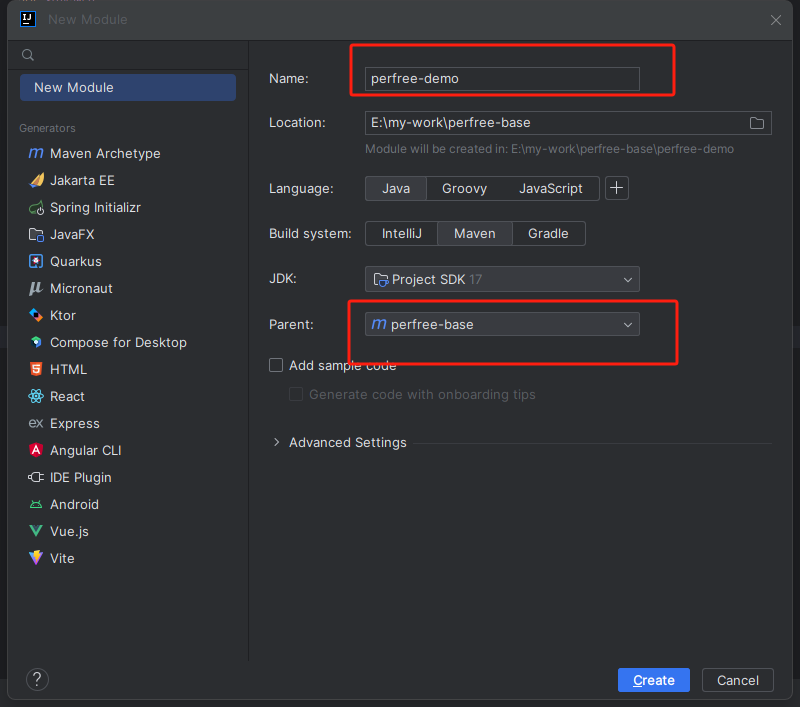
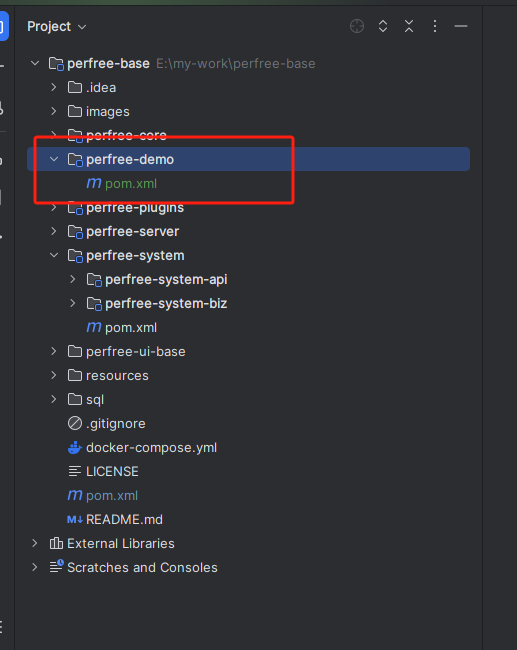

# 创建新模块
项目默认有一个perfree-system系统模块,创建新模块其实就是参考该模块进行创建,把代码更好的区分,以下内容会演示如何创建一个新的模块

1. 使用idea 右键new-> Module,创建模块perfree-demo
   
2. 删除src目录,并修改pom.xml
   
```xml
<?xml version="1.0" encoding="UTF-8"?>
<project xmlns="http://maven.apache.org/POM/4.0.0"
         xmlns:xsi="http://www.w3.org/2001/XMLSchema-instance"
         xsi:schemaLocation="http://maven.apache.org/POM/4.0.0 http://maven.apache.org/xsd/maven-4.0.0.xsd">
    <modelVersion>4.0.0</modelVersion>
    <parent>
        <groupId>com.perfree</groupId>
        <artifactId>perfree-base</artifactId>
        <version>1.0-SNAPSHOT</version>
    </parent>

    <groupId>com.perfree</groupId>
    <artifactId>perfree-demo</artifactId>
    <packaging>pom</packaging>
    <description>demo服务</description>

    <properties>
        <project.build.sourceEncoding>UTF-8</project.build.sourceEncoding>
        <project.reporting.outputEncoding>UTF-8</project.reporting.outputEncoding>
    </properties>

    <dependencyManagement>
        <dependencies>
            <dependency>
                <groupId>com.perfree</groupId>
                <artifactId>perfree-core</artifactId>
                <version>1.0-SNAPSHOT</version>
            </dependency>
        </dependencies>
    </dependencyManagement>
</project>
```
3. 创建perfree-demo-api模块
   
4. 修改perfree-demo-api模块pom.xml
```xml
<?xml version="1.0" encoding="UTF-8"?>
<project xmlns="http://maven.apache.org/POM/4.0.0"
         xmlns:xsi="http://www.w3.org/2001/XMLSchema-instance"
         xsi:schemaLocation="http://maven.apache.org/POM/4.0.0 http://maven.apache.org/xsd/maven-4.0.0.xsd">
    <modelVersion>4.0.0</modelVersion>
    <parent>
        <groupId>com.perfree</groupId>
        <artifactId>perfree-demo</artifactId>
        <version>1.0-SNAPSHOT</version>
    </parent>

    <artifactId>perfree-demo-api</artifactId>

    <properties>
        <maven.compiler.source>17</maven.compiler.source>
        <maven.compiler.target>17</maven.compiler.target>
        <project.build.sourceEncoding>UTF-8</project.build.sourceEncoding>
    </properties>

    <dependencies>
        <dependency>
            <groupId>org.springframework.boot</groupId>
            <artifactId>spring-boot-starter-web</artifactId>
        </dependency>
        <dependency>
            <groupId>org.projectlombok</groupId>
            <artifactId>lombok</artifactId>
        </dependency>
    </dependencies>
</project>
```
5. 创建perfree-demo-biz模块
   
6. 修改perfree-demo-biz模块pom.xml
```xml
<?xml version="1.0" encoding="UTF-8"?>
<project xmlns="http://maven.apache.org/POM/4.0.0"
         xmlns:xsi="http://www.w3.org/2001/XMLSchema-instance"
         xsi:schemaLocation="http://maven.apache.org/POM/4.0.0 http://maven.apache.org/xsd/maven-4.0.0.xsd">
    <modelVersion>4.0.0</modelVersion>
    <parent>
        <groupId>com.perfree</groupId>
        <artifactId>perfree-demo</artifactId>
        <version>1.0-SNAPSHOT</version>
    </parent>

    <artifactId>perfree-demo-biz</artifactId>

    <properties>
        <maven.compiler.source>17</maven.compiler.source>
        <maven.compiler.target>17</maven.compiler.target>
        <project.build.sourceEncoding>UTF-8</project.build.sourceEncoding>
    </properties>

    <dependencies>
        <dependency>
            <groupId>com.perfree</groupId>
            <artifactId>perfree-core</artifactId>
        </dependency>
        <dependency>
            <groupId>com.perfree</groupId>
            <artifactId>perfree-system-api</artifactId>
            <version>1.0-SNAPSHOT</version>
        </dependency>
    </dependencies>

</project>
```
7. 修改perfree-server模块pom.xml,将perfree-demo-biz模块依赖进去
```xml
 <dependency>
    <groupId>com.perfree</groupId>
    <artifactId>perfree-demo-biz</artifactId>
    <version>1.0-SNAPSHOT</version>
</dependency>
```
8. 刷新maven配置
   
9. 至此,新的模块创建就完毕了,您可以在perfree-demo-biz模块中写一些测试controller进行测试,这里写了一个测试controller进行测试
   
10. 启动项目访问
   
