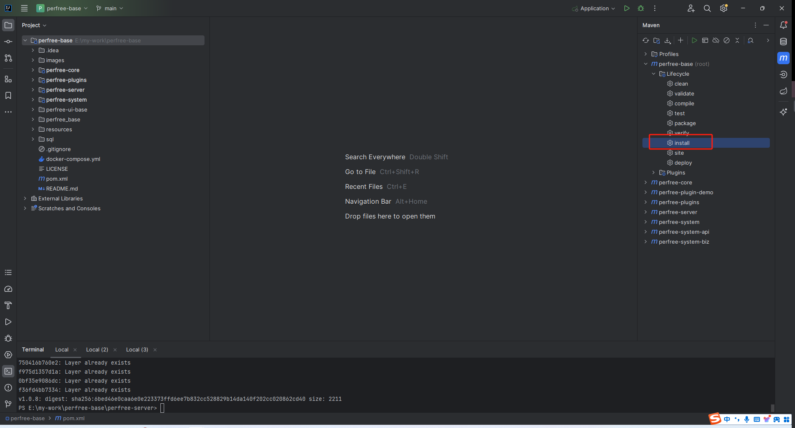
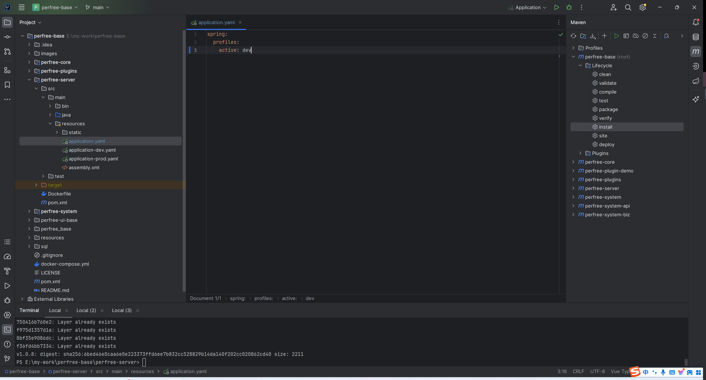
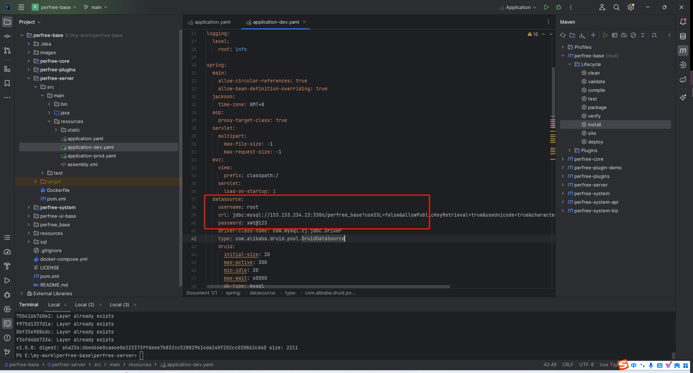

# 后端源码运行
项目要求JDK版本>=17, Mysql5.7+,推荐使用[IntelliJ IDEA](https://www.jetbrains.com.cn/idea/) 进行开发,请先检查环境是否支持
## 源码运行
1. 使用idea打开项目根目录,等待依赖下载完毕
2. 执行maven install
   
3. 修改perfree-server/src/main/resources/application.yaml为开发环境
   
4. 修改perfree-server/src/main/resources/application-dev.yaml中的数据库相关配置信息
   
5. 运行perfree-server模块中的Application类即可
