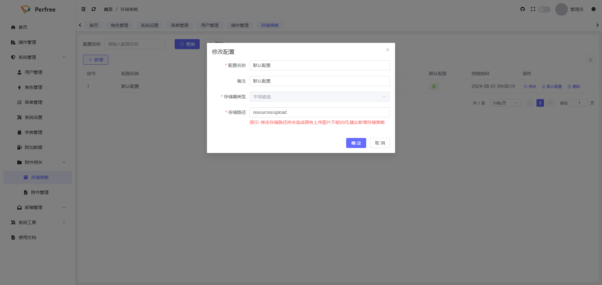
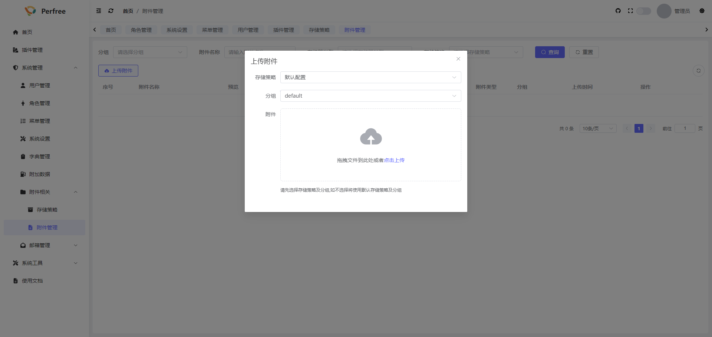

# 附件相关
系统中的附件功能支持本地存储和任意S3对象存储, 在系统初始安装时,可以在附件相关->存储策略中看到默认了一个存储策略,该默认存储策略采用的就是本地磁盘存储

您可以在此界面中继续新增相关存储策略配置,新增完毕后如需上传文件默认全部使用该配置的话,在列表中点击默认配置将其设置为默认即可

## 附件上传
点击附件管理中的上传附件按钮即可进行附件上传,其中存储策略会自动默认为配置的默认配置,您也可以选择其他的存储策略进行上传,分组默认为default,您也可以选择其他分组或输入新的分组

## 注意事项
如遇到上传失败的问题,可检查存储策略是否配置正确,Nginx是否限制了文件上传大小等
