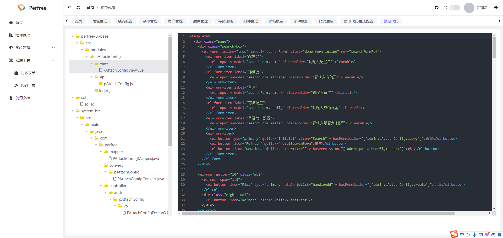

# 代码生成
在使用代码生成前,您可以先创建数据库表,之后在代码生成界面中点击导入表进行后续代码生成操作

## 配置
点击配置按钮,可进行代码生成的信息配置,可根据需要进行修改

## 预览
配置完信息后,可点击预览,查看生成的代码是否有问题

## 下载使用
以上步骤没问题后,可点击下载按钮,将生成的代码进行下载,下载后的压缩包目录如下

其中sql目录中存放了菜单权限的sql,直接执行即可,perfree-ui-base为前台代码,复制进前台源码目录中即可,system-biz为后台代码,复制进对应目录重启项目即可

