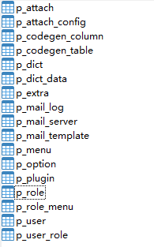

# Docker安装
在操作之前,您应先检查是否已经安装了Docker及Mysql环境, 如未安装,可参考以下文档进行安装

- Docker 安装文档：[https://docs.docker.com/engine/install/](https://docs.docker.com/engine/install/)
- Mysql 安装文档: [https://dev.mysql.com/doc/refman/8.0/en/installing.html](https://dev.mysql.com/doc/refman/8.0/en/installing.html)
> **💡提示**<br>
> 我们推荐按照 Docker 官方文档安装 Docker，因为部分 Linux 发行版软件仓库中的 Docker 版本可能过旧。

## 初始化数据库
首先需要创建一个字符集为utf8mb4名为perfree_base(也可以是其他名字)的数据库,之后执行项目中 [sql](https://github.com/perfree/perfree-base/tree/main/sql) 目录中的perfree_base.sql文件,
执行完毕后会看到有下图这些表



## 启动后台
```bash
sudo docker run -d -p 8080:8080 --name perfree_base --privileged=true \
-e "JAVA_OPTS=-Xms128m -Xmx128m -Djava.security.egd=file:/dev/./urandom" \
-e "SPRING_DATASOURCE_USERNAME=数据库账户" \
-e "SPRING_DATASOURCE_URL=jdbc:mysql://数据库ip地址:数据库端口/创建的数据库名称?useSSL=false&allowPublicKeyRetrieval=true&useUnicode=true&characterEncoding=UTF-8&nullCatalogMeansCurrent=true" \
-e "SPRING_DATASOURCE_PASSWORD=数据库密码" \
-v /home/perfree-base/plugins:/perfree-server/resources/plugins \
-v /home/perfree-base/upload:/perfree-server/resources/upload \
registry.cn-hangzhou.aliyuncs.com/perfree/perfree_base:版本号
```
-v为挂载的目录,防止重启后数据丢失,自行修改即可
## 前台启动
```bash
docker run -d -p 8066:80 --name perfree_base-ui -e "SERVER_ADDR_IP=后台的ip地址" -e "SERVER_ADDR_PORT=后台的端口"  registry.cn-hangzhou.aliyuncs.com/perfree/perfree_base-ui:版本号
```
启动成功之后访问ip:8066即可, 默认账户admin, 密码123456
## 更新
```bash
# 停止后台
docker stop perfree_base
docker rm perfree_base

# 停止前台
docker stop perfree_base-ui
docker rm perfree_base-ui
```
之后重新执行启动后台和前台的命令即可
