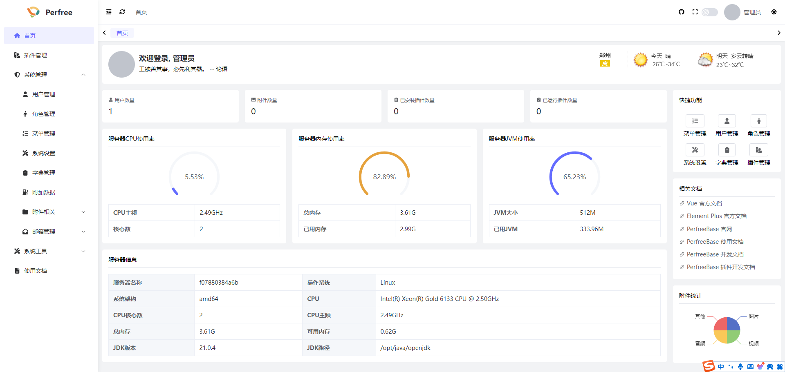
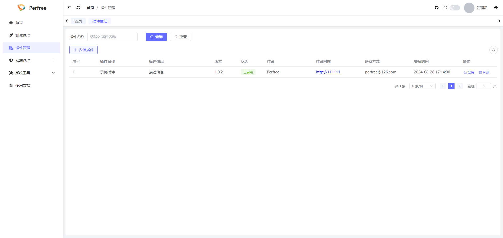
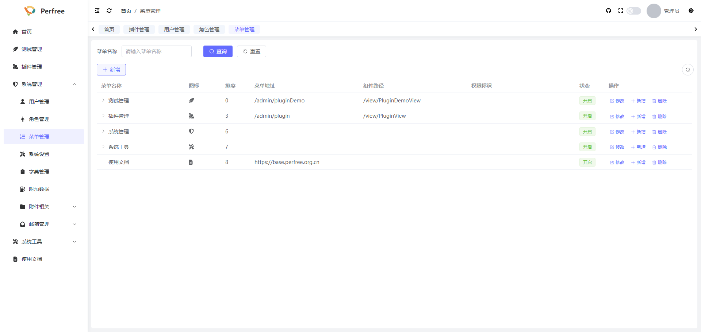

# 简介

[PerfreeBase](https://base.perfree.org.cn)是一款基于Springboot+Vue3的管理后台模板,支持前后端插件化开发及生产环境动态插拔，有问题一个插件搞定, 杜绝加班！

## 🏷 声明
本系统不会有任何商业版本,所有代码全部开源!
在使用过程中如果有问题，可以通过[Github Issue](https://github.com/perfree/perfree-base/issues)或者 [Gitee Issue](https://gitee.com/perfree/perfree-base/issues)进行反馈。 
微信交流群(添加时备注PerfreeBase):

## 🏷 功能简介
- 设计简洁，界面美观
- 前后端支持插件动态化开发,生产环境动态插拔
- 支持系统/插件代码生成
- 支持加载动态权限菜单，按钮级别权限控制
- 基础功能全面,包含用户、角色、菜单、字典、插件、附件、邮箱等管理功能
- ......
## 🏷 技术栈

| 名称           | 版本     |
|--------------|--------|
| JDK          | \>=17  |
| mysql        | 8.0.21 |
| SpringBoot   | 3.2.1  |
| mybatis-plus | 3.5.6  |
| security     | 6.2.1  |
| vue          | 3.4.29 |
| element plus | 2.7.7  |

## 🏷 预览图

