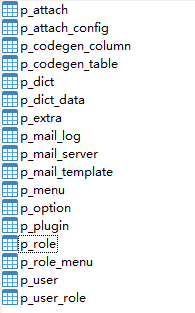

# Jar包安装
在操作之前,您应先检查是否已经安装了Mysql、Java(版本要大于或等于17)、Nginx环境, 如未安装,可参考以下文档进行安装

- Mysql 安装文档: [https://dev.mysql.com/doc/refman/8.0/en/installing.html](https://dev.mysql.com/doc/refman/8.0/en/installing.html)
> **💡提示**<br>
> 这一步骤请注意java版本一定要大于或等于17
## 版本下载
前往[https://github.com/perfree/perfree-base/releases](https://github.com/perfree/perfree-base/releases)下载发布的版本包,并将其上传至服务器

## 初始化数据库
首先需要创建一个字符集为utf8mb4名为perfree_base(也可以是其他名字)的数据库,之后执行项目中 [sql](https://github.com/perfree/perfree-base/tree/main/sql) 目录中的perfree_base.sql文件,
执行完毕后会看到有下图这些表



## 后台部署
解压perfree-server.zip,并修改解压出来的config/application-prod.yaml文件,主要修改数据库相关的内容
```yaml
  datasource:
    username: 数据库账户
    url: jdbc:mysql://数据库ip:数据库端口/数据库名称?useSSL=false&allowPublicKeyRetrieval=true&useUnicode=true&characterEncoding=UTF-8&nullCatalogMeansCurrent=true
    password: 数据库密码
```


然后执行以下命令
```bash
./start.sh start
```
如遇到`-bash: ./start.sh: /bin/bash^M: 坏的解释器: 没有那个文件或目录错误`,则执行以下命令
```bash
sed -i 's/\r//' ./start.sh
./start.sh start
```

## 前台部署
解压perfree-base-ui.zip文件,之后修改Nginx的配置文件,可参考如下,替换里边的中文内容即可
```
server {
    listen       80 default_server;
    server_name  域名或ip;

    gzip on;
    gzip_min_length 1k;
    gzip_buffers 4 16k;
    gzip_http_version 1.1;
    gzip_comp_level 2;
    gzip_types text/plain application/x-javascript text/css application/xml application/javascript;
    gzip_proxied any;
    client_max_body_size 500m;

    location / {
        root   前台zip解压后的路径;
        index  index.html index.htm;
        try_files $uri $uri/ /index.html;
    }

    location /api/ {
        proxy_pass http://后台项目ip:后台项目端口/api/;
        proxy_set_header Host $http_host;
        proxy_set_header X-Real-IP $remote_addr;
        proxy_set_header REMOTE-HOST $remote_addr;
        proxy_set_header X-Forwarded-For $proxy_add_x_forwarded_for;
    }
}
```
之后重新加载nginx即可
```bash
nginx -s reload
```

启动成功之后访问ip或者域名即可, 默认账户admin, 密码123456

## 更新
1. 下载更新包上传至服务器
2. 进入后台所在目录执行`./start.sh stop`
3. 将后台更新包解压覆盖至原目录
4. 启动后台`./start.sh start`
5. 将前台更新包解压覆盖至前台原目录即可
