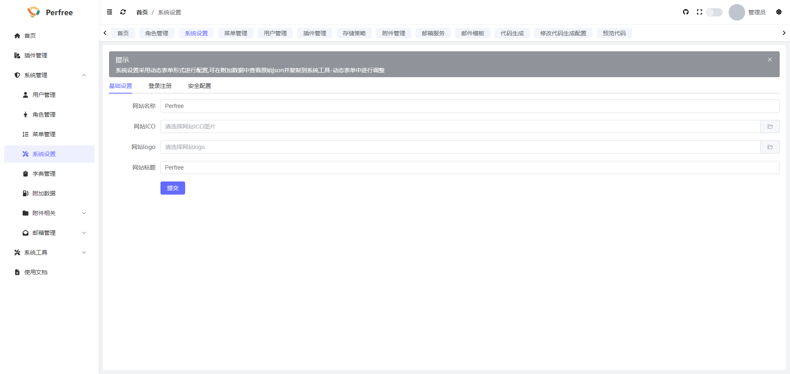
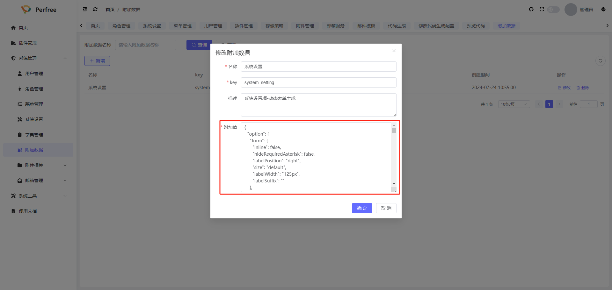

# 系统设置相关
系统设置中存放了系统的一些基本信息设置项,您可在此进行修改相关设置项

## 新增或修改设置项
系统设置采用动态表单开发,如需新增或修改系统设置中的设置项,您可以按照以下步骤操作

1. 打开系统管理-> 附加数据页面,找到名称为系统设置的附加数据,点击修改,复制其中的附加值
   
2. 打开系统工具-> 动态表单,点击导入json,将复制的附加值粘贴进去,并点击确定
   
3. 在此界面中进行动态表单配置,新增或修改配置项
4. 修改完毕后点击生成json
   
5. 点击复制json,并将其粘贴至系统管理-> 附加数据页面中的系统设置的附加数据值中
6. 之后再打开系统设置就是修改后的页面了
